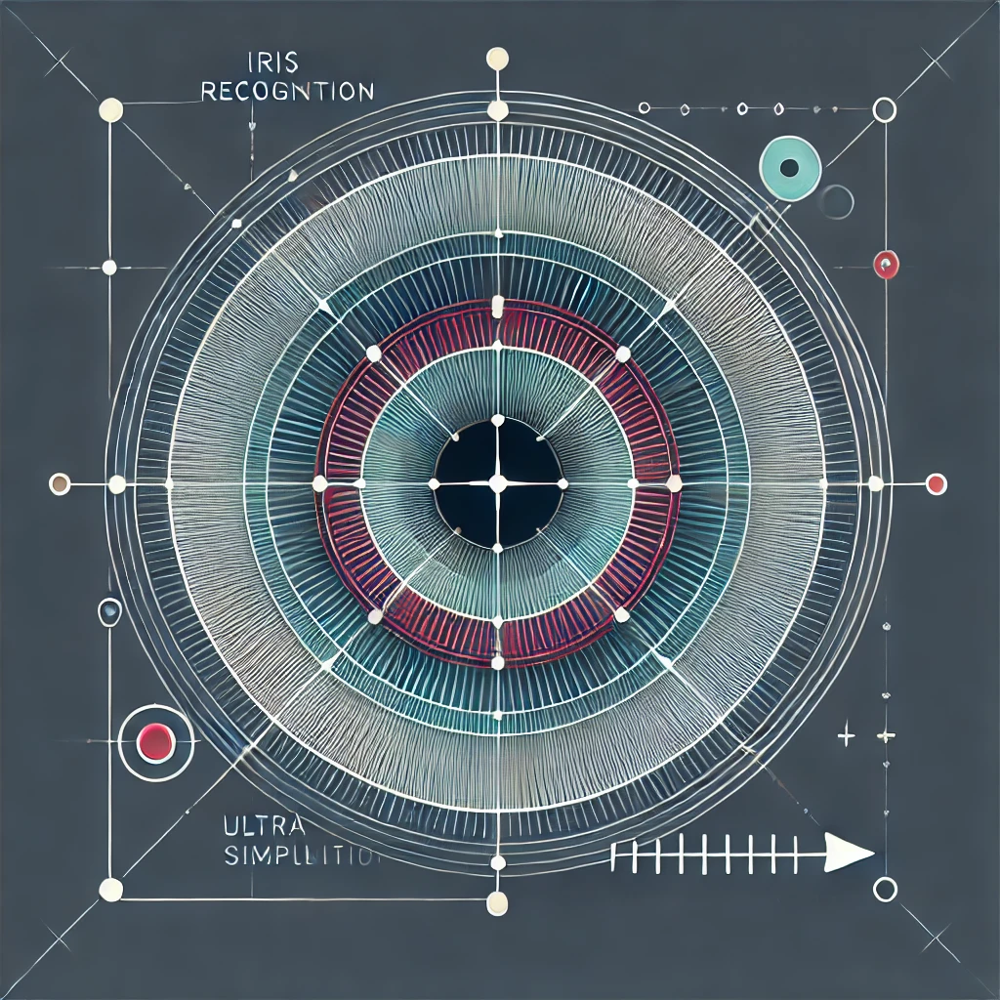

# Iris recognition

<div align="center">
  
</div>


Implementation of ZKML iris recognition, inspired by the worldcoin iris recognition pipeline.

## How to use

### 1. Input Generation

Hardcode the path of your iris images in src/main.py (default uses samples)

Then to generate the iris code input ("input.json") for the ONNX model run (it will also perform the matching and ouput the distance in a non proved way) :

```bash
python src/main.py
```

File proving/matching/input.json has been generated.

```bash
cd proving/matching
```

The directory contains :

* network.onnx : the hamming distance onnx model
* input.json : the input of the model
* gen_calibration.py (optionnal, can be executed to generate calibration.json)

### 2. Proving

#### With EZKL CLI
Install EZKL then 

1. Setup and prove :
```bash
ezkl gen-settings 
ezkl compile-circuit
ezkl gen-witness
ezkl gen-srs
ezkl setup 
ezkl prove
```


#### With Archon CLI
Install archon then :

1. Create artifact :
```bash
archon create-artifact -a matching --data-path input.json --model-path network.onnx
```

2. Setup and prove :

```bash
archon job -a matching gen-settings 
archon job -a matching compile-circuit
archon job -a matching gen-witness
archon job -a matching gen-srs
archon job -a matching setup 
archon job -a matching prove
```


